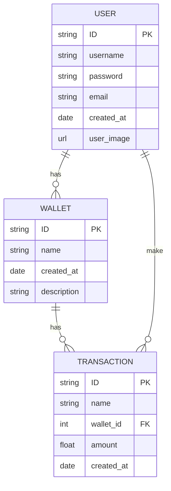

# Finance Tracker  Platform

- [Finance Tracker  Platform](#finance-tracker--platform)
  - [About](#about)
  - [Installation](#installation)
        - [Note for backend](#note-for-backend)
  - [Backend](#backend)
    - [API Documentation](#api-documentation)
      - [Transactions](#transactions)
        - [Get all transactions](#get-all-transactions)
        - [Get transaction by id](#get-transaction-by-id)
        - [Create transaction](#create-transaction)
        - [Update transaction](#update-transaction)
        - [Delete transaction](#delete-transaction)
    - [Schema](#schema)
  - [Issues](#issues)


  
## About
Welcome to our personal finance app! Our app is designed to help you manage your finances and achieve your financial goals. We understand that managing your money can be stressful, time-consuming, and confusing, but we believe that it doesn't have to be. Our app provides a simple, user-friendly interface that makes it easy to track your income, expenses, and savings, so you can get a clear picture of your financial health.


## Installation
Run
```bash
git clone https://github.com/BinniesLite/finance_app.git
```

To start the project from the root of the project using Docker Compose, run the command `docker compose up` in your terminal.

Make sure you have Docker and docker compose installed on your machine. 

For front-end navigate to **localhost:80** and for back-end navigate to **localhost:3000**

After adding packages or changing dockerfile, run `docker compose up --build -d` to rebuild the images in detached mode.


##### Note for backend
To make changes to database, you will need to first open the integrated terminal inside the container to make changes to the database. Check Prisma documentation for more instructions on how to interact with the database.

Run `docker exec -it backend bash` to open the integrated terminal inside the container. 


##  Backend

This is the backend of the project. It is a RESTful API built with Node.js and Express.js. It is connected to a PostgreSQL database using Docker.


### API Documentation

#### Transactions
##### Get all transactions
```http
GET /api/transactions
```

##### Get transaction by id
```http
GET /api/transactions/${id}
```

##### Create transaction
```http
POST /api/transactions/create
```

##### Update transaction
```http
PUT /api/transactions/${id}
```

##### Delete transaction
```http
DELETE /api/transactions/delete/${id}
```


### Schema



## Issues
If you have any issues with the project, please feel free to open an issue on the repo.
