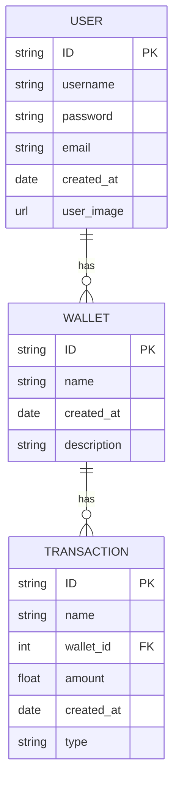

# Finance Tracker  Platform

- [Finance Tracker  Platform](#finance-tracker--platform)
  - [About](#about)
  - [Installation](#installation)
    - [Note for backend](#note-for-backend)
  - [Backend](#backend)
    - [API Documentation](#api-documentation)
      - [Transactions](#transactions)
        - [Get all transactions](#get-all-transactions)
        - [Get transaction by id](#get-transaction-by-id)
        - [Create transaction](#create-transaction)
        - [Update transaction](#update-transaction)
        - [Delete transaction](#delete-transaction)
    - [Schema](#schema)
  - [Issues](#issues)

## About

Welcome to our personal finance app! Our app is designed to help you manage your finances and achieve your financial goals. We understand that managing your money can be stressful, time-consuming, and confusing, but we believe that it doesn't have to be. Our app provides a simple, user-friendly interface that makes it easy to track your income, expenses, and savings, so you can get a clear picture of your financial health.

## Installation

Run

```bash
git clone https://github.com/BinniesLite/finance_app.git
```

To start the project from the root of the project using Docker Compose, run the command `docker compose up` in your terminal.

Make sure you have Docker and docker compose installed on your machine.

For front-end navigate to **localhost:80** and for back-end navigate to **localhost:3000**

After adding packages or changing dockerfile, run `docker compose up --build -d` to rebuild the images in detached mode.

##### Note for backend

To make changes to database, you will need to first open the integrated terminal inside the container to make changes to the database. Check Prisma documentation for more instructions on how to interact with the database.

Run `docker exec -it backend bash` to open the integrated terminal inside the container.

## Backend

This is the backend of the project. It is a RESTful API built with Node.js and Express.js. It is connected to a PostgreSQL database using Docker.

### API Documentation
<space>

### Transactions

##### Get all transactions

```http
GET /api/transaction
```

##### Get transaction by id

```http
GET /api/transaction/${id}
```

##### Get all transactions by wallet id

```http
GET /api/transaction/wallet/${id}
```

##### Create transaction

```http
POST /api/transaction/create
```
##### Delete transaction

```http
DELETE /api/transaction/delete/${id}
```

##### Update transaction

```http
PUT /api/transaction/${id}
```
<space>

### Wallet
##### Get all wallets

```http
GET /api/wallet
```

##### Get wallet by id

```http
GET /api/wallet/${id}
```

##### Create wallet

```http
POST /api/wallet/create
```

##### Delete wallet

```http
DELETE /api/wallet/delete/${id}
```

##### Change wallet name

```http
PUT /api/wallet/name/${id}
```
<space>

### Filter

##### Get all transactions by date

```http
GET /api/filter/transactions-by-date
example: /api/filter/transactions-by-date?start=2021-10-01&end=2021-10-31
```

##### Get all transactions by type

```http
GET /api/filter/transaction/${type}
```

##### Get all transactions by range of amount

```http
GET /api/filter/transactions-by-amount
example: /api/filter/transactions-by-amount?min=100&max=1000
```
<space>

### Calculation
##### Get total income

```http
GET /api/calculation/total-income
```

##### Get total expense

```http
GET /api/calculation/total-expense
```

##### Get total balance

```http
GET /api/calculation/balance
```
---------------------

##### Get total income by wallet id

```http
GET /api/calculation/total-income-by-walletid/${id}
```

##### Get total expense by wallet id

```http
GET /api/calculation/total-expense-by-walletid/${id}
```

##### Get total balance by wallet id

```http
GET /api/calculation/balance-by-walletid/${id}
```

---------------------

##### Get total income by date

```http
GET /api/calculation/total-income-by-date
example: /api/calculation/total-income-by-date?start=2021-10-01&end=2021-10-31
```

##### Get total expense by date

```http
GET /api/calculation/total-expense-by-date
example: /api/calculation/total-expense-by-date?start=2021-10-01&end=2021-10-31
```

##### Get total balance by date

```http
GET /api/calculation/balance-by-date
example: /api/calculation/balance-by-date?start=2021-10-01&end=2021-10-31
```
<space>

### Schema



## Issues

If you have any issues with the project, please feel free to open an issue on the repo.
