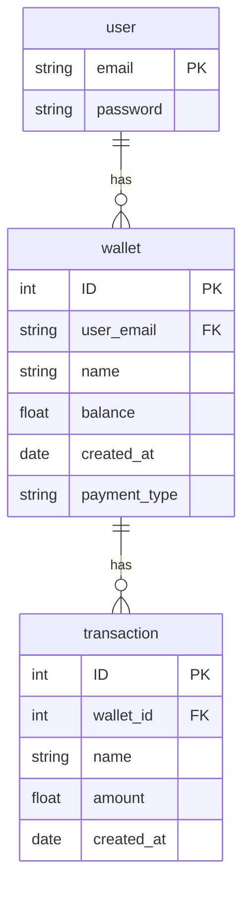

# Finance Tracker  Platform

- [Finance Tool Platform](#finance-tracker-platformplatform)
  - [About](#about)
  - [Installation/Usage](#installation)
  - [Architecture](#architecture)
  - [Backend](#backend)
    - [API Documentation](#api-documentation)

## About

Welcome to our personal finance app! Our app is designed to help you manage your finances and achieve your financial goals. We understand that managing your money can be stressful, time-consuming, and confusing, but we believe that it doesn't have to be. Our app provides a simple, user-friendly interface that makes it easy to track your income, expenses, and savings, so you can get a clear picture of your financial health.

## Installation

Run

```bash
git clone https://github.com/BinniesLite/finance_app.git
```

To start the project from the root of the project using Docker Compose, run the command `docker compose up` in your terminal.

Make sure you have Docker and docker compose installed on your machine.

For front-end navigate to **localhost:80** and for back-end navigate to **localhost:5000**

When adding a new package to the project, delete all images and dockerfile and run `docker compose up --build` to rebuild the images.

## Backend

This is the backend of the project. It is a RESTful API built with Node.js and Express.js. It is connected to a PostgreSQL database using Docker.

### API Documentation

#### User

##### Get all users

```http
GET /api/user
```

##### Get transaction by email

```http
GET /api/user/email
```

##### Create user

```http
POST /api/user/create
```

##### Update user

```http
PUT /api/user/email
```

##### Delete user

```http
DELETE /api/user/email
```

#### Wallet

##### Get all wallets

```http
GET /api/wallet
```

##### Get wallet by id

```http
GET /api/wallet/${id}
```

##### Create wallet

```http
POST /api/wallet/create
```

##### Update wallet

```http
PUT /api/wallet/${id}
```

##### Delete wallet

```http
DELETE /api/wallet/${id}
```

#### Transaction

##### Get all transactions

```http
GET /api/transaction
```

##### Get transaction by id

```http
GET /api/transaction/${id}
```

##### Create transaction

```http
POST /api/transaction/create
```

##### Update transaction

```http
PUT /api/transaction/${id}
```

##### Delete transaction

```http
DELETE /api/transaction/${id}
```

#### Schema



## Issues

If you have any issues with the project, please feel free to open an issue on the repo.
